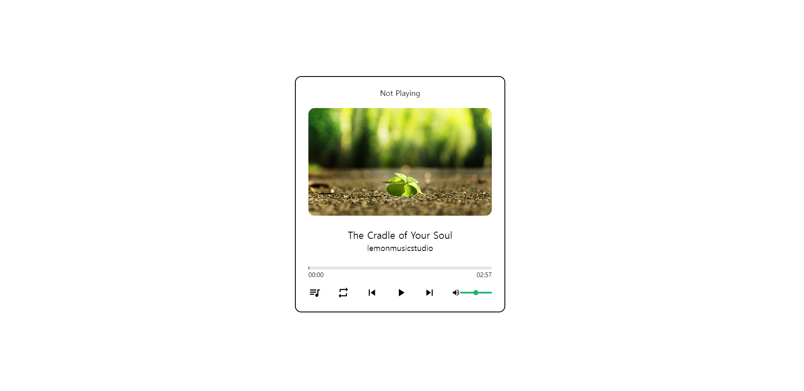
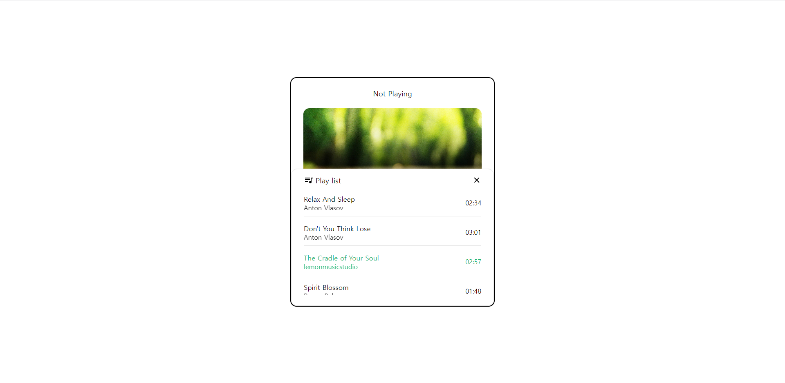

# music player

music player app 입니다. 화면은 크게 썸네일 화면과 컨트롤러 바로 구성되어 있습니다. 썸네일 화면에는 상단에 "Not Playing", "Now Playing" 으로 음악 재생의 여부를 확인 할 수 있으며 썸네일 이미지와 곡 제목, 아티스트명은 재생되는 곡에 맞게 바뀝니다.

컨트롤러는 곡의 런닝타임을 나타내는 재생 바, 플레이리스트 버튼, 플레이 모드 버튼, 이전 버튼, 재생 버튼, 다음 버튼, 음량 조절 바가 있습니다.

각 구성 별로 기능이 존재합니다. 재생 바는 재생을 나타내기도 하지만 클릭 시 원하는 시간 때로 이동하여 재생이 가능 합니다.
플레이리스트 버튼은 클릭시 플레이리스트 모달 창이 나타납니다.

현재 재생 중인 곡에는 초록색으로 표기되며, 드래그 드랍으로 곡의 순서를 바꿀 수 있습니다. 플레이리스트 창을 닫으려면 우측 상단에 엑스 버튼을 누르면 됩니다.

플레이 모드 버튼은 일반 재생, 교차 재생, 한곡 반복이 있습니다.

이전 버튼, 재생 버튼, 다음 버튼은 곡을 이동하고 재생 할 때 사용됩니다.

음량 조절 바는 노래의 음량 폭을 클릭 드래그로 조절 합니다.
